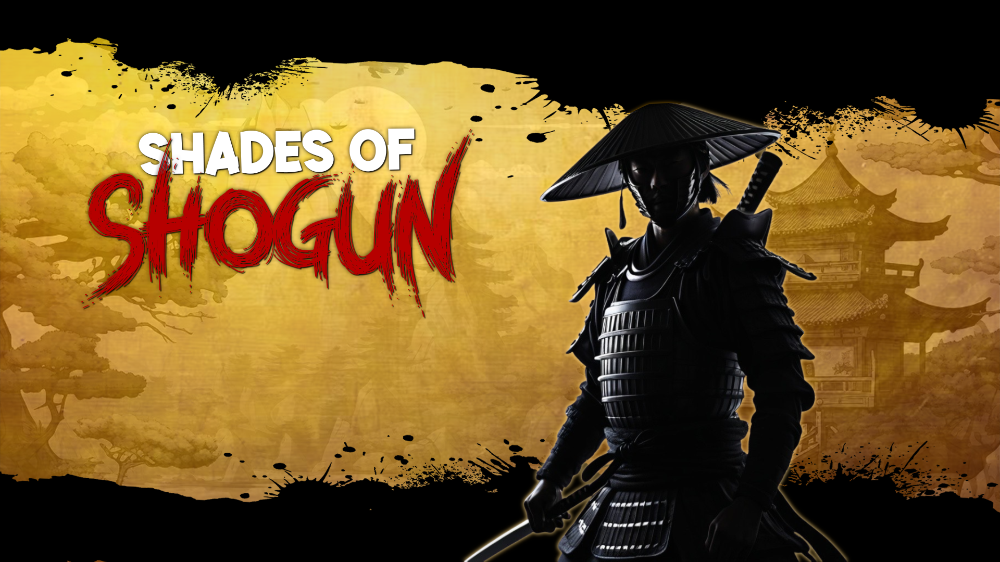

# Shades-Of-Shogun-v0.2.1

 SOS gameplay walkthrough 

"Shades of Shogun" is a 2D action platformer prototype featuring responsive movement, basic combat, and Beautiful levels. This early version focuses on core gameplay mechanics and visual clarity.  
 - Check releases for the latest playable build 

a Sem 3 (2nd year) - University Project, developed by a team of 5 young developers.

My Role (Mrunal Mendole) - Game Designer & Programmer:
1) Collaborated in a 5-member team to develop a fast-paced 2D action platformer Prototype, designing core game concept & mechanics
2) Designed and programmed levels with dynamic camera system, interactive environments focusing platforming flows.
3) Experimented with a dialogue system Plug in, Co-developed Dynamic UI, sound design using Unity’s built-in tools

Credits:  
Music:  
Adrian von Ziegler - Into Soltitude: https://youtu.be/RG76jpoZM2M?si=HF9QXbPb43rW3LnC
Adrian von Ziegler - Immortal: https://youtu.be/fIqNveNdkgU?si=WboPwlLp5HozYByO    
Hiroyuki Sawano - Shingeki No Kyojin OST: https://youtu.be/47RK0qI2DiI?si=saoJ1L8RKPWbH_jx     

Fonts:  
The Branded Quotes - Nightcore Demo: https://sellfy.com/thebrandedquotes

